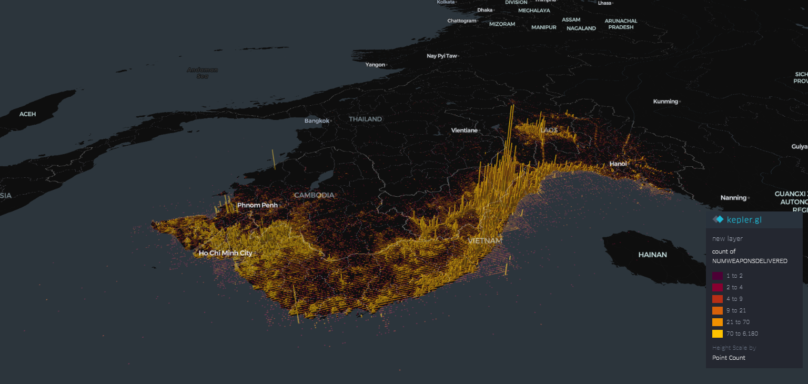

# UXO Risk Analysis in Vietnam

## 📌 Introduction

During the **Vietnam War Resistance Against the United States (1955–1975)**, the U.S. military conducted an extensive aerial bombing campaign across Vietnam, Laos, and Cambodia. According to historical records, the United States carried out over **3 million air missions** during the war and dropped approximately **7.5 million tons of bombs** — more than all bombs used in World War II combined.

This intense bombing has led to widespread **Explosive War Remnants (EWR)**, especially **Unexploded Ordnance (UXO)**, which continue to pose severe threats to lives, agriculture, and socio-economic development in the region. These lingering remnants of war have **caused countless injuries, deaths, and land contamination**, making large areas uninhabitable or dangerous to cultivate.

---

## 📊 Bombs Dropped Visualization

*Figure: A 3D column chart showing the number of bombs, missiles, and rockets dropped during the war. Each vertical column represents the quantity dropped by type, giving a visual overview of the scale of aerial operations.*

---

## 🎯 Project Objective

This project applies **data science and geospatial analysis techniques** to:
- Identify regions in Vietnam with a **high risk of UXO contamination**.
- Support **strategic UXO clearance planning** by estimating cleanup **costs and prioritization**.
- Provide **interactive visualizations** to communicate historical and predictive insights to stakeholders.

The ultimate goal is to assist humanitarian demining efforts and policy-making by turning complex war data into actionable insights.

---

## 📁 Dataset

We use the **[US Air Force Bombing Database (THOR)](https://www.kaggle.com/datasets/usaf/air-force-bombing-database-thor)**, which contains detailed records of aerial missions flown by the U.S. during major 20th-century conflicts, including:
- Dates and locations of air missions
- Weapon types and quantities used
- Target information and outcomes

**Data Source:** Kaggle  
🔗 [USAF THOR Bombing Database on Kaggle](https://www.kaggle.com/datasets/usaf/air-force-bombing-database-thor)

---

## 🛠️ Technologies Used

- Python (Pandas, Matplotlib, Seaborn)
- Kepler.gl and other GIS tools
- Jupyter Notebooks for EDA
- Data preprocessing and spatial clustering

---

## 📌 Next Steps

- Use machine learning to model UXO risk zones
- Incorporate population and infrastructure data
- Recommend optimal cleanup strategies based on cost-risk analysis

---

## 📜 License

This project is for educational and humanitarian purposes only. Please cite the data source if reused.

